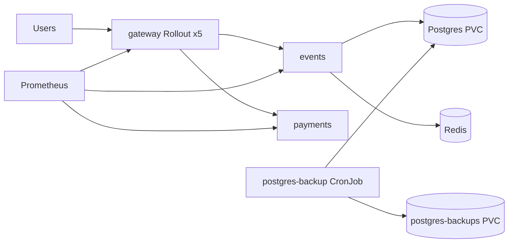

# QuickTicket SRE Handbook

## Architecture



- `gateway` is the public entrypoint and the only component exposed to users.
- `events` owns reads and ticket reservation logic; it depends on both Postgres and Redis.
- `payments` is a downstream dependency used on checkout.
- Postgres is persisted on a PVC and backed up by a CronJob into a separate PVC.
- Prometheus scrapes the application metrics and is the first place to look during an incident.

## How to deploy

1. Create a feature branch from `main`.
2. Make the repo change and update the required submission file.
3. Push the branch and open a PR.
4. After merge, CI updates image tags in `k8s/`.
5. Argo Rollouts / GitOps reconciles the new revision into the cluster.
6. Watch the gateway rollout and confirm it reaches `Healthy`.

Helpful commands:

```bash
kubectl get pods,svc
kubectl get rollout gateway
kubectl argo rollouts get rollout gateway
```

## Monitoring

Golden signals to check first:

- request rate
- 5xx error rate
- request latency, especially p95/p99
- saturation on Postgres and `events`

High-signal queries:

```promql
sum(rate(gateway_requests_total[1m]))
```

```promql
sum(rate(gateway_requests_total{status=~"5.."}[1m]))
```

```promql
histogram_quantile(0.99, sum by (le, path) (rate(gateway_request_duration_seconds_bucket[1m])))
```

When debugging inventory behavior, keep `409` separate from `5xx`.

## Incident response

1. Confirm current health:

```bash
kubectl run smoke --image=curlimages/curl:latest --rm -i --restart=Never --quiet --command -- \
  curl -s http://gateway:8080/health
```

2. Check whether the failure is user-visible latency, `5xx`, or sold-out inventory.
3. Inspect `gateway`, `events`, `payments`, and Postgres pod status.
4. If the issue is a bad rollout, abort or promote back to stable traffic:

```bash
kubectl argo rollouts get rollout gateway
kubectl argo rollouts abort gateway
```

5. If the issue is stateful recovery, follow the backup/restore procedure below.

Escalation rule:

- `gateway` 5xx or p99 breach affecting users is higher priority than background job noise.

## Backup and restore

Manual backup:

```bash
kubectl exec -i $(kubectl get pod -l app=postgres -o name) -- \
  pg_dump -U quickticket -Fc quickticket > /tmp/quickticket.dump
```

Restore:

```bash
POD=$(kubectl get pod -l app=postgres -o jsonpath='{.items[0].metadata.name}')
kubectl cp /tmp/quickticket.dump $POD:/tmp/backup.dump
kubectl exec $POD -- pg_restore -U quickticket -d quickticket --clean --if-exists /tmp/backup.dump
kubectl rollout restart deployment/events
kubectl rollout status deployment/events --timeout=180s
```

Automated backup:

- `postgres-backup` CronJob writes dumps to `/backups`
- retention keeps the 5 newest dumps
- `backup-inspector` can be used to inspect the files

Verification:

```bash
kubectl exec deployment/backup-inspector -- ls -la /backups
kubectl logs job/manual-7
```
